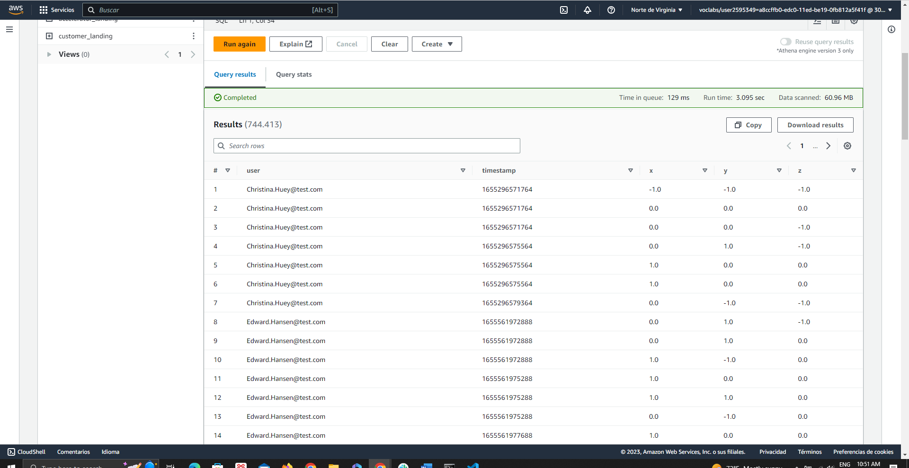
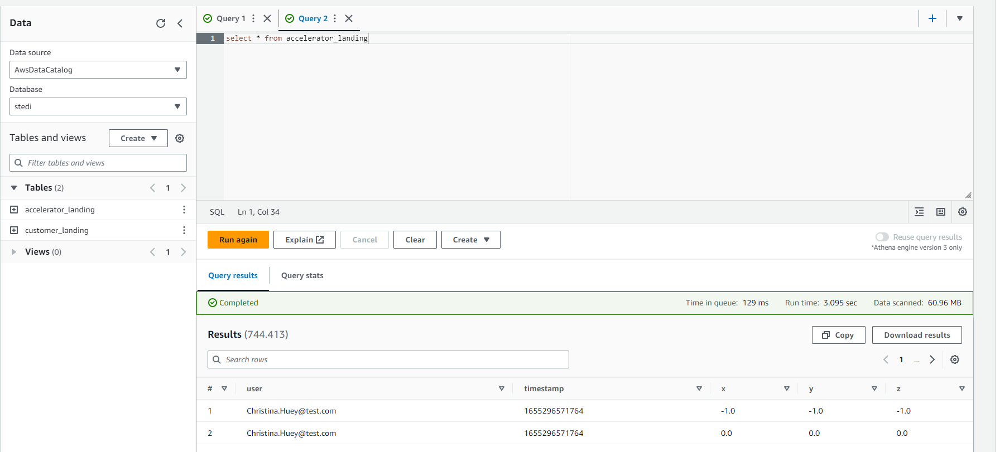
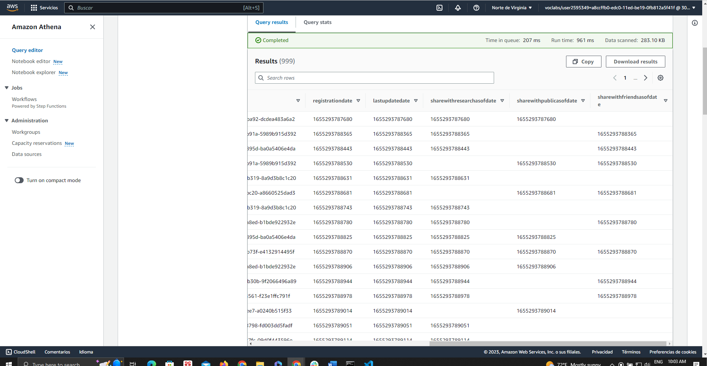
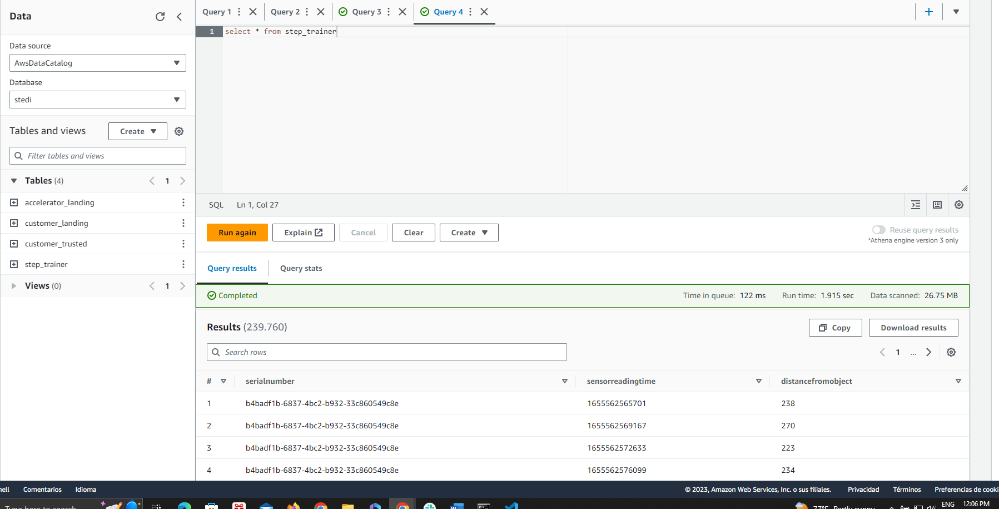
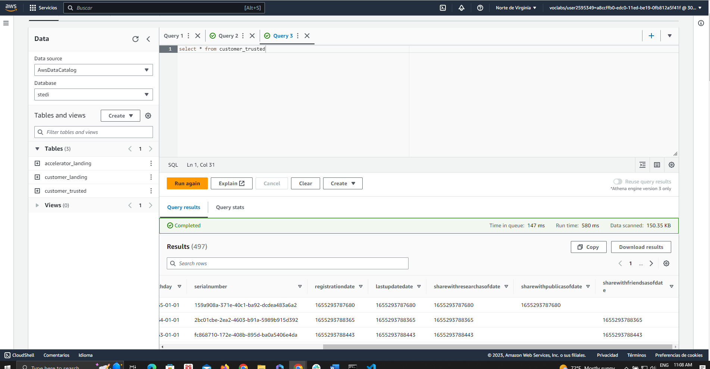
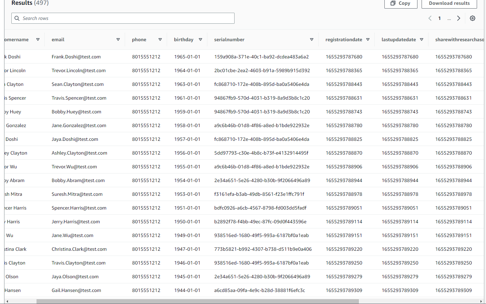

# Udacity_3rd_project
Code for the 3rd project of Udacity. To start the project one first needs 
to run some AWS CLI commmands.

# Run the following commands to create the necessary AWS permissions:
## Create bucket
```
aws s3 mb s3://project-stedi-eva
```
## Get EC2 vpcs
```
aws ec2 describe-vpcs
```
## Get routing table
```
aws ec2 describe-route-tables
```
## Create S3 Gateway:
```
aws ec2 create-vpc-endpoint --vpc-id vpc-0551922c355e4c00e 
--service-name com.amazonaws.us-east-1.s3 --route-table-ids 
rtb-026a0073a5bf4fa1e
```
## Create an IAM role for glue:
```
aws iam create-role --role-name my-glue-service-role 
--assume-role-policy-document '{
    "Version": "2012-10-17",
    "Statement": [
        {
            "Effect": "Allow",
            "Principal": {
                "Service": "glue.amazonaws.com"
            },
            "Action": "sts:AssumeRole"
        }
    ]
}'
## Grant provileges of Glue for the S3 bucket
aws iam put-role-policy --role-name my-glue-service-role --policy-name S3Access
 --policy-document '{ 
"Version": "2012-10-17", "Statement": [ { "Sid": "ListObjectsInBucket",
 "Effect": "Allow", "Action": [ "s3:ListBucket" ],
"Resource": [ "arn:aws:s3:::project-stedi-eva" ] }, { "Sid": 
"AllObjectActions", "Effect": "Allow", "Action": "s3:*Object",
"Resource": [ "arn:aws:s3:::project-stedi-eva/*" ] } ] }'
## Give Glue access to data in S3
aws iam put-role-policy --role-name my-glue-service-role --policy-name 
GlueAccess --policy-document '{
    "Version": "2012-10-17",
    "Statement": [
        {
            "Effect": "Allow",
            "Action": [
                "glue:*",
                "s3:GetBucketLocation",
                "s3:ListBucket",
                "s3:ListAllMyBuckets",
                "s3:GetBucketAcl",
                "ec2:DescribeVpcEndpoints",
                "ec2:DescribeRouteTables",
                "ec2:CreateNetworkInterface",
                "ec2:DeleteNetworkInterface",
                "ec2:DescribeNetworkInterfaces",
                "ec2:DescribeSecurityGroups",
                "ec2:DescribeSubnets",
                "ec2:DescribeVpcAttribute",
                "iam:ListRolePolicies",
                "iam:GetRole",
                "iam:GetRolePolicy",
                "cloudwatch:PutMetricData"
            ],
            "Resource": [
                "*"
            ]
        },
        {
            "Effect": "Allow",
            "Action": [
                "s3:CreateBucket",
                "s3:PutBucketPublicAccessBlock"
            ],
            "Resource": [
                "arn:aws:s3:::aws-glue-*"
            ]
        },
        {
            "Effect": "Allow",
            "Action": [
                "s3:GetObject",
                "s3:PutObject",
                "s3:DeleteObject"
            ],
            "Resource": [
                "arn:aws:s3:::aws-glue-*/*",
                "arn:aws:s3:::*/*aws-glue-*/*"
            ]
        },
        {
            "Effect": "Allow",
            "Action": [
                "s3:GetObject"
            ],
            "Resource": [
                "arn:aws:s3:::crawler-public*",
                "arn:aws:s3:::aws-glue-*"
            ]
        },
        {
            "Effect": "Allow",
            "Action": [
                "logs:CreateLogGroup",
                "logs:CreateLogStream",
                "logs:PutLogEvents",
                "logs:AssociateKmsKey"
            ],
            "Resource": [
                "arn:aws:logs:*:*:/aws-glue/*"
            ]
        },
        {
            "Effect": "Allow",
            "Action": [
                "ec2:CreateTags",
                "ec2:DeleteTags"
            ],
            "Condition": {
                "ForAllValues:StringEquals": {
                    "aws:TagKeys": [
                        "aws-glue-service-resource"
                    ]
                }
            },
            "Resource": [
                "arn:aws:ec2:*:*:network-interface/*",
                "arn:aws:ec2:*:*:security-group/*",
                "arn:aws:ec2:*:*:instance/*"
            ]
        }
    ]
}'
```
## To recursively copy all the data in local in one folder to another
```
aws s3 cp ./project/starter/customers/ s3://project-stedi-eva/customer/landing/ 
--recursive
```
# Then create the Glue jobs to ingest data or copy the data from local to s3
Use the .py file of landing for this purpose or upload with CLI

# Verify the structure of the data:
First create all tables with glue as the SQL files in here, and then use athena
to verify that the tables are well uploaded.
# Use the .py files in here to create the remaining tables, filter and join
First run the landing to trusted of them all and then the curated files

# Images of Athena of the processes are:












